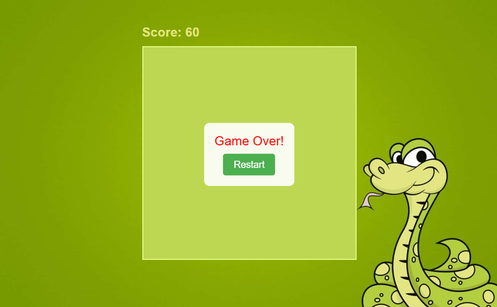

# Snake Game

A classic snake game built using HTML, CSS, and JavaScript.

## Features
- Classic snake gameplay mechanics
- Score tracking
- Game over screen with restart option
- Responsive design

## Screenshot

## How to Play
1. Use arrow keys to control the snake's direction
2. Eat the red food to grow longer and increase your score
3. Avoid hitting walls or your own tail
4. Click 'Restart' after game over to play again

## Installation
1. Clone the repository
2. Open `index.html` in your browser
3. Start playing!

## Technologies Used
- HTML5
- CSS3
- JavaScript

## License
MIT